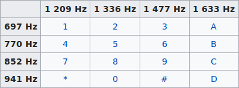
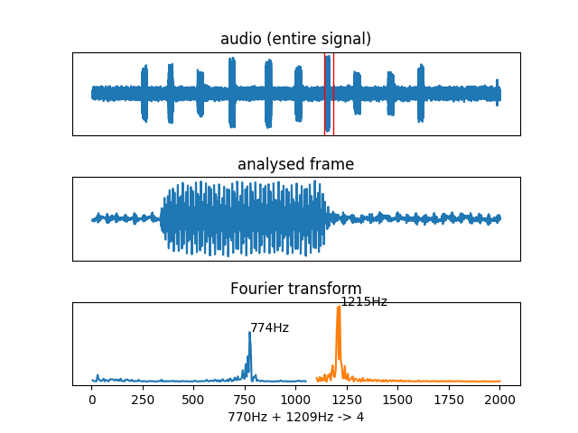

# DTMF decoder
(Sorry for my English, I'm not dumb but French. Feel free to make a PR to correct this README.)

Have you always dreamt of finding the phone number dialled by someone in a video? It's possible now! All you have to do is record the audio of the *beeps* and this script will extract the phone number for you from the dial tones.

## Installation
(If you are on Mac or Windows, go to hell.)

```
$ git clone https://github.com/ribt/dtmf-decoder.git
$ cd dtmf-decoder/
$ sudo python3 -m pip install -r requirements.txt --upgrade
$ chmod +x dtmf.py
$ sudo cp dtmf.py /usr/local/bin/dtmf
```

## Usage

You have to give a wav file (you can try to convert it with `ffmpeg -i audio.mp3 audio.wav` for example).

```
Usage: dtmf [-h] [-v] [-l] [-r] [-d] [-t F] [-i T] file.wav

optional arguments:
  -h, --help     show this help message and exit
  -v, --verbose  show a complete timeline
  -l, --left     left channel only (if the sound is stereo)
  -r, --right    right channel only (if the sound is stereo)
  -d, --debug    show graphs to debug
  -t F           acceptable frequency error (in hertz, 20 by default)
  -i T           process by T seconds intervals (0.05 by default)
```

## Examples

You can test this script with these examples :
- [a perfect file without noise](https://github.com/ribt/dtmf-decoder/blob/master/perfect-example.wav?raw=true)
- [a non-perfect file with noise](https://github.com/ribt/dtmf-decoder/blob/master/not-perfect-example.wav?raw=true)

#### The perfect case

```
$ dtmf perfect-example.wav
0123456789
```
As you can see it works perfectly, we have a classical French phone number.

#### The non-perfect case
```
$ dtmf not-perfect-example.wav
012374526789
```
We can guess there is a problem because we have more than ten numbers. So try the verbose output:
```
$ dtmf -v not-perfect-example.wav
0:00 ...................0
0:01 0..........1111.....
0:02 .....222............
0:03 33........7.......44
0:04 .......5..........2.
0:05 .66666............77
0:06 777.............888.
0:07 ..........99........
0:08 .................
```
We can guess there are false positives so try to decrease the tolerance:
```
$ dtmf -v -t 10 not-perfect-example.wav 
0:00 ...................0
0:01 0..........111......
0:02 .....222............
0:03 3..................4
0:04 .......5............
0:05 ..66.6..............
0:06 7...............88..
0:07 ...........9........
0:08 .................
```
The number `6` must have been split into two so the number is `0123456789`.

## How it works

This script is quite simple. We split the signal into frames and we analyse them one by one. We calculate a Fast Fourier Transorm to find its constituent frequencies. We find the frequencies with the bigger amplitude and we compare them with the DTMF's (dual-tone multi-frequency) frequencies.

DTMF keypad frequencies from Wikipedia:



Graph explaining the functioning :




